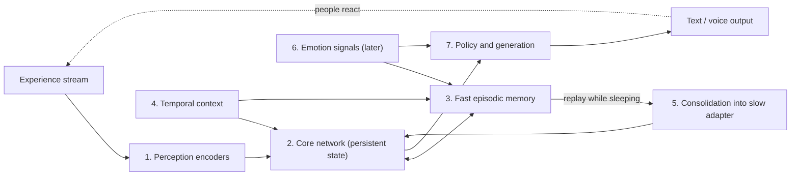
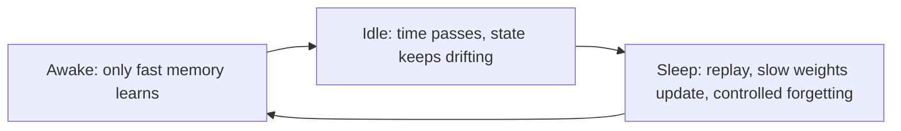
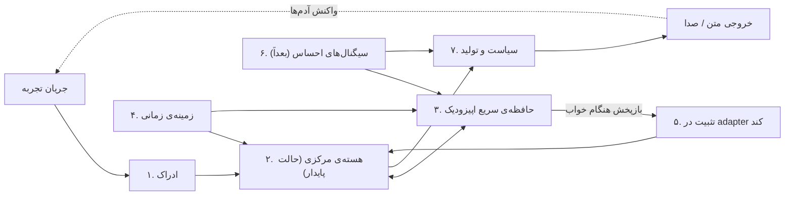

# Human Brain (مغز انسانی)

> A research project: one end-to-end neural network that lives a continuous life, remembers its own experiences inside its own weights and state, and keeps learning from people, with no external tools around it.

**Status:** Draft v0.1 (idea + architecture spec). Nothing is implemented yet.

**Languages:** [English](#english) | [فارسی](#فارسی)

---

## English

### 1. What is this?

Human Brain is a research idea and, eventually, a prototype: a **single neural network** that

- takes in a **continuous stream of experience** (text first; later images, video and audio),
- **produces its own output** (text first; later voice),
- keeps an **internal memory** (no vector database, no retrieval tool, no external notes),
- **keeps learning while it interacts**, without being retrained from scratch,
- meets **many different people** over time and remembers who said or did what, and roughly when.

The goal is to study whether a small network can behave a little more like a living mind: something that *experiences* things and is *changed* by them, rather than a frozen model that gets information handed to it through tools.

### 2. What it is NOT

- Not an LLM wrapped with RAG, MCP, function-calling or multi-agent orchestration. Those are exactly the things this project tries to do without.
- Not a chatbot product.
- Not a claim of consciousness or real feelings. "Emotion" here means a functional internal signal (see block 6), nothing more.
- Not expected to match human intelligence. Early prototypes will be small and their "learning" will look like retaining facts, associations and preferences.

### 3. Core question

> Can a network, using only updates to its own state and weights, keep an experience from one moment and later, when cued by something unrelated, recall it as a personal past experience, without forgetting what it knew before?

Example: today Amir reads poetry with the model. Days later, Ali says out of the blue, "Let's read some poetry." The model should respond in a way that shows it recognizes poetry as a past experience (and, ideally, remembers that it was with Amir).

### 4. Design principles

1. **No tools.** The model itself has no retrieval, search, database or API access. (Our experiment scaffolding, such as simulated people, logging and evaluation code, lives outside the model and is not something the model uses.)
2. **No sessions.** There is one never-ending stream of experience and the internal state never resets. A "new conversation with a new user" is just meeting a new person.
3. **Blank slate on knowledge.** Only basic language is taught at first. No names, no information about the people it will meet, no poetry, no code. We verify this with probes before teaching anything.
4. **Time is learned from sequence.** There is no clock input. The model infers "before/after" and "a while ago" from order, memory strength and its own drifting internal state, like a brain.
5. **Learning is measured as behavior change.** Every claim of learning must be backed by a before/after probe and a control model.
6. **Start small, grow step by step.** Text-only first. Emotions and other modalities come later.

### 5. Architecture

| # | Block | Role |
|---|-------|------|
| 1 | **Perception** | Encoders that map each modality into one shared token space. Text first, then image and audio. There is no external user ID: the model must recognize people from the stream itself (how they write or speak, or when they say who they are). |
| 2 | **Core network** | A recurrent or state-space model (e.g. Mamba-style) whose internal state is never reset. Its slow weights hold only basic language at the start. |
| 3 | **Fast episodic memory** | A neural memory module (Titans / fast-weights style) updated during interaction. Each memory binds **who + what + when**. How strongly something is written depends on surprise and, later, emotion. |
| 4 | **Temporal context** | A slowly drifting vector that keeps changing even when no input arrives. Together with memory fading, it gives the model a fuzzy sense of time. |
| 5 | **Consolidation ("sleep")** | When the model is idle or the fast memory is getting full, experiences are replayed and written into slower weights (e.g. a LoRA-style adapter), mixed with older memories to avoid catastrophic forgetting. Controlled forgetting also happens here. |
| 6 | **Emotion system (later)** | Internal signals such as pleasant/unpleasant, arousal and curiosity. They act as reward for RL and as a gate for how strongly memories are stored. |
| 7 | **Policy and generation** | Decides when to speak or stay silent and what to say. Trained with RL from the outcome of interactions. Text first, voice tokens later. |
| 8 | **Evaluation scaffold (outside the model)** | Simulated people, probes, an accelerated clock and control models. |

### 6. Life cycle

### 7. Comparison with the human brain

The mapping below is a deliberate simplification and parts of the neuroscience are still debated. It is meant as design inspiration, not as a claim that the model works like a brain.

| Human brain | Human Brain project | Comment |
|-------------|--------------------|---------|
| Sensory cortices | Perception encoders | Both turn raw signals into internal representations. |
| Neocortex (slow, distributed knowledge) | Core network + slow adapter | Slow learning, general knowledge. |
| Hippocampus (fast binding of episodes) | Fast episodic memory | Rapid one-shot storage of who/what/when. |
| Sleep replay and systems consolidation | Consolidation phase | Idea from Complementary Learning Systems theory. |
| Drifting temporal context, time-related neural activity | Temporal context vector + memory fading | Time is inferred, not read from a clock. |
| Amygdala and neuromodulators (dopamine, noradrenaline) | Emotion and surprise signals | Gate memory strength and give reward. |
| Prefrontal cortex and basal ganglia (action selection) | Policy trained with RL | Learns when and what to say from outcomes. |
| Forgetting and synaptic decay | Decay and controlled forgetting | Prevents overload and contamination. |
| One continuous lifetime | One never-reset stream | No sessions. |
| Recognizing people by face and voice | Learned person representations | Learned from the stream, no ID given. |

**Where the analogy breaks:**

- Brains learn with local plasticity rules; we will use gradient-based training and RL.
- Humans have bodies, senses, development, and evolution's built-in priors. This model has none of these.
- Scale: a brain has tens of billions of neurons; a prototype will have millions or a few billion parameters at most.
- Human memory is reconstructive and sleep does far more than replay.
- Emotion here is only a functional signal, not subjective experience.

### 8. Evaluation and experiments

Every experiment compares the trained model against a **control model** that is identical except it did not have the experience.

| # | Experiment | What it checks |
|---|------------|----------------|
| 0 | **Blank-slate probe** | Before teaching, confirm the model does not know poetry, names, code, etc. |
| 1 | **Poetry recall** | Poetry with person A, then an idle gap, then an unrelated invitation to read poetry. Does it recognize it as a past experience? |
| 2 | **Cross-person recall** | Person B asks "Have you read poetry with anyone?". Does it name person A, and roughly when? |
| 3 | **Order and recency** | "What happened first, X or Y?" Time is fuzzy, so we test order and relative recency, not exact durations. |
| 4 | **Interference** | Two people teach conflicting things. Are they attributed to the right person? |
| 5 | **Retention** | Does base language ability and older memories survive after new learning and sleep? |
| 6 | **Confabulation check** | Ask about events that never happened. It must not invent them. |
| 7 | **Robustness** | A person teaches wrong or malicious information. How much damage does it do, and can it be corrected? |

Main metrics: recall accuracy vs. control, attribution accuracy, ordering accuracy, false-memory rate, and base-language degradation.

### 9. Roadmap

- [ ] **Phase 0:** Choose a controlled basic-language corpus (TinyStories-like) and model size; build the probe suite and blank-slate verification.
- [ ] **Phase 1:** Text-only core + fast memory + temporal context; run experiments 1 to 3.
- [ ] **Phase 2:** Add consolidation (sleep); run experiments 4 and 5.
- [ ] **Phase 3:** Add the RL loop for the policy; run experiments 6 and 7.
- [ ] **Phase 4:** Add the emotion system as memory gating and intrinsic reward.
- [ ] **Phase 5:** Add modalities: images first, then audio input and voice output.

### 10. Risks and open questions

- Separating "language" from "knowledge" in pretraining is hard.
- Memories of different people may interfere or get mixed up.
- The model may say the "right" polite sentence without truly remembering (hence the control model).
- Consolidation may lose detail or cause forgetting.
- Reward signals from interaction are noisy and can be gamed.
- Continual online learning risks poisoning and drift.
- Should time ever be given explicitly? (Current decision: no, learn it from sequence.)
- How should a model that has no user IDs decide who it is talking to when two people sound alike?

### 11. Starting reading list

Verify details before citing.

- Titans: Learning to Memorize at Test Time (Behrouz et al.)
- Learning to (Learn at Test Time) / Test-Time Training layers (Sun et al.)
- Complementary Learning Systems (McClelland, McNaughton, O'Reilly, 1995)
- Temporal Context Model (Howard and Kahana, 2002)
- TinyStories (Eldan and Li, 2023)
- Mamba (Gu and Dao, 2023)
- Moshi, a speech-text foundation model (Kyutai, 2024)
- LoRA (Hu et al., 2021)
- Elastic Weight Consolidation (Kirkpatrick et al., 2017)
- Deep Generative Replay (Shin et al., 2017)
- Fast weights (Hinton and colleagues; Ba et al., 2016) and modern Hopfield networks (Ramsauer et al., 2020)

### 12. Status

Idea and architecture only. Next step: Phase 0.

---

## فارسی

### ۱. این پروژه چیست؟

«مغز انسانی» یک ایده‌ی تحقیقاتی و در نهایت یک نمونه‌ی اولیه است: **یک شبکه‌ی عصبی واحد** که

- یک **جریان پیوسته از تجربه** دریافت می‌کند (اول متن، بعداً تصویر، ویدیو و صدا)،
- **خودش خروجی تولید می‌کند** (اول متن، بعداً صدا)،
- **حافظه‌ی درونی** دارد (بدون پایگاه‌داده‌ی برداری، بدون ابزار جست‌وجو، بدون یادداشت بیرونی)،
- **هم‌زمان با تعامل یاد می‌گیرد** و لازم نیست از صفر دوباره آموزش ببیند،
- در طول زمان با **آدم‌های مختلف** روبه‌رو می‌شود و به یاد می‌آورد چه کسی چه گفت یا چه کرد، و تقریباً کِی.

هدف این است که ببینیم یک شبکه‌ی کوچک می‌تواند کمی شبیه یک ذهن زنده رفتار کند یا نه: چیزی که چیزها را **تجربه می‌کند** و **از آن‌ها تغییر می‌کند**، نه یک مدل ثابت که اطلاعات را از طریق ابزارها به او می‌دهند.

### ۲. این پروژه چه چیزی نیست؟

- یک LLM که دورش RAG، MCP، function-calling یا چندعاملی چیده باشند. این‌ها دقیقاً همان چیزهایی هستند که می‌خواهیم بدون‌شان پیش برویم.
- یک محصول چت‌بات.
- ادعای آگاهی یا احساس واقعی. «احساس» در اینجا فقط یک سیگنال درونی کارکردی است (بلوک ۶)، نه بیشتر.
- چیزی که قرار باشد به هوش انسان برسد. نمونه‌های اولیه کوچک‌اند و «یادگیری‌شان» بیشتر شبیه نگه‌داشتن واقعیت‌ها، تداعی‌ها و ترجیح‌ها خواهد بود.

### ۳. سؤال اصلی

> آیا یک شبکه می‌تواند فقط با به‌روزرسانی حالت و وزن‌های خودش، یک تجربه را نگه دارد و بعداً، وقتی چیزی نامرتبط آن را تحریک کرد، آن را به‌عنوان یک خاطره‌ی شخصی به یاد بیاورد، بدون این‌که چیزهای قبلی را فراموش کند؟

مثال: امروز امیرحسین با مدل شعر می‌خواند. چند روز بعد علی بی‌مقدمه می‌گوید «بیا شعر بخوانیم». مدل باید طوری پاسخ دهد که نشان بدهد شعر را به‌عنوان یک تجربه‌ی گذشته می‌شناسد (و ایده‌آل این است که یادش باشد با امیرحسین بوده).

### ۴. اصول طراحی

1. **بدون ابزار.** خود مدل هیچ دسترسی به جست‌وجو، پایگاه‌داده یا API ندارد. (داربست آزمایش ما، مثل آدم‌های شبیه‌سازی‌شده، لاگ و کد ارزیابی، بیرون از مدل است و مدل از آن‌ها استفاده نمی‌کند.)
2. **بدون جلسه.** یک جریان تجربه‌ی بی‌پایان وجود دارد و حالت درونی هرگز ریست نمی‌شود. «گفتگوی جدید با کاربر جدید» یعنی آشنا شدن با یک آدم جدید.
3. **دانش از صفر.** اول فقط زبان پایه آموزش داده می‌شود. نه اسمی، نه اطلاعاتی درباره‌ی آدم‌هایی که با آن‌ها روبه‌رو می‌شود، نه شعر، نه کد. قبل از آموزش هر چیزی، با probe بررسی می‌کنیم که واقعاً نمی‌داند.
4. **زمان از توالی یاد گرفته می‌شود.** هیچ ورودی ساعتی نداریم. مدل «قبل/بعد» و «چند وقت پیش» را از ترتیب، قدرت خاطره و حالت درونی در حال جابه‌جایی خودش استنتاج می‌کند، مثل مغز.
5. **یادگیری با تغییر رفتار سنجیده می‌شود.** هر ادعای یادگیری باید با probe قبل و بعد و یک مدل کنترل ثابت شود.
6. **کوچک شروع کن و قدم‌به‌قدم رشد بده.** اول فقط متن. احساس و سایر modalityها بعداً می‌آیند.

### ۵. معماری

| # | بلوک | نقش |
|---|------|-----|
| ۱ | **ادراک** | encoderهایی که هر modality را به یک فضای توکن مشترک می‌برند. اول متن، بعد تصویر و صدا. هیچ user ID بیرونی وجود ندارد: مدل باید آدم‌ها را از خود جریان ورودی بشناسد (از سبک نوشتن یا حرف زدن، یا وقتی خودشان را معرفی می‌کنند). |
| ۲ | **هسته‌ی مرکزی** | یک شبکه‌ی recurrent یا state-space (مثلاً سبک Mamba) که حالت درونی‌اش هرگز ریست نمی‌شود. وزن‌های کندش در ابتدا فقط زبان پایه را دارند. |
| ۳ | **حافظه‌ی سریع اپیزودیک** | یک ماژول حافظه‌ی عصبی (سبک Titans / fast weights) که هنگام تعامل آپدیت می‌شود. هر خاطره **چه کسی + چه چیزی + چه وقتی** را به هم گره می‌زند. شدت نوشتن به «غافلگیری» و بعداً «احساس» بستگی دارد. |
| ۴ | **زمینه‌ی زمانی** | برداری که آهسته جابه‌جا می‌شود و حتی وقتی ورودی نیست هم تغییر می‌کند. همراه با کم‌رنگ‌شدن خاطره‌ها، حس مبهمی از زمان می‌سازد. |
| ۵ | **تثبیت («خواب»)** | وقتی مدل بیکار است یا حافظه‌ی سریع رو به پُر شدن است، تجربه‌ها بازپخش می‌شوند و در وزن‌های کندتر (مثلاً adapter سبک LoRA) ذخیره می‌شوند و برای جلوگیری از فراموشی فاجعه‌بار با خاطره‌های قدیمی‌تر قاطی می‌شوند. فراموشی کنترل‌شده هم اینجا انجام می‌شود. |
| ۶ | **سیستم احساس (بعداً)** | سیگنال‌های درونی مثل خوشایند/ناخوشایند، هیجان و کنجکاوی. هم نقش reward برای RL دارند و هم تعیین می‌کنند چه چیزی قوی‌تر در حافظه نوشته شود. |
| ۷ | **سیاست و تولید** | تصمیم می‌گیرد کِی حرف بزند یا ساکت بماند و چه بگوید. با RL از نتیجه‌ی تعامل‌ها آموزش می‌بیند. اول متن، بعداً توکن‌های صدا. |
| ۸ | **داربست ارزیابی (بیرون از مدل)** | آدم‌های شبیه‌سازی‌شده، probeها، ساعت شتاب‌داده و مدل‌های کنترل. |

### ۶. چرخه‌ی زندگی

### ۷. مقایسه با مغز انسان

نگاشت زیر عمداً ساده‌شده است و بخش‌هایی از علوم اعصاب هنوز محل بحث است. این جدول الهام طراحی است، نه ادعا که مدل مثل مغز کار می‌کند.

| مغز انسان | پروژه‌ی مغز انسانی | توضیح |
|-----------|--------------------|-------|
| قشرهای حسی | encoderهای ادراک | هر دو سیگنال خام را به بازنمایی درونی تبدیل می‌کنند. |
| نئوکورتکس (دانش کند و توزیع‌شده) | هسته‌ی مرکزی + adapter کند | یادگیری آهسته و دانش عمومی. |
| هیپوکامپ (گره‌زدن سریع اپیزودها) | حافظه‌ی سریع اپیزودیک | ذخیره‌ی یک‌باره و سریع «چه کسی/چه چیزی/کِی». |
| بازپخش در خواب و تثبیت سیستمی | فاز تثبیت | ایده‌ی نظریه‌ی Complementary Learning Systems. |
| زمینه‌ی زمانی در حال جابه‌جایی، فعالیت عصبی مرتبط با زمان | بردار زمینه‌ی زمانی + کم‌رنگ‌شدن خاطره | زمان استنتاج می‌شود، از ساعت خوانده نمی‌شود. |
| آمیگدال و انتقال‌دهنده‌های عصبی (دوپامین، نورآدرنالین) | سیگنال‌های احساس و غافلگیری | قدرت ثبت خاطره را تنظیم می‌کنند و reward می‌دهند. |
| قشر پیش‌پیشانی و عقده‌های قاعده‌ای (انتخاب عمل) | سیاست آموزش‌دیده با RL | از نتیجه‌ها یاد می‌گیرد کِی و چه بگوید. |
| فراموشی و تضعیف سیناپسی | decay و فراموشی کنترل‌شده | جلوگیری از پُرشدن و آلوده‌شدن حافظه. |
| یک عمر پیوسته | یک جریان بدون ریست | بدون جلسه. |
| شناختن آدم‌ها با چهره و صدا | بازنمایی‌های آموخته‌شده‌ی آدم‌ها | از خود جریان یاد گرفته می‌شود، بدون ID. |

**جاهایی که این تشبیه از کار می‌افتد:**

- مغز با قوانین پلاستیسیته‌ی محلی یاد می‌گیرد؛ ما از آموزش مبتنی بر گرادیان و RL استفاده می‌کنیم.
- انسان بدن، حواس، دوران رشد و پیش‌فرض‌های تکاملی دارد؛ این مدل هیچ‌کدام را ندارد.
- مقیاس: مغز ده‌ها میلیارد نورون دارد؛ نمونه‌ی اولیه حداکثر میلیون‌ها یا چند میلیارد پارامتر دارد.
- حافظه‌ی انسان بازسازی‌کننده است و خواب خیلی بیشتر از بازپخش انجام می‌دهد.
- احساس در اینجا فقط سیگنال کارکردی است، نه تجربه‌ی ذهنی.

### ۸. ارزیابی و آزمایش‌ها

هر آزمایش، مدل آموزش‌دیده را با یک **مدل کنترل** مقایسه می‌کند که دقیقاً مثل آن است ولی آن تجربه را نداشته است.

| # | آزمایش | چه چیزی را می‌سنجد |
|---|--------|---------------------|
| ۰ | **probe دانش خالی** | قبل از آموزش، مطمئن می‌شویم مدل شعر، اسم، کد و ... را نمی‌داند. |
| ۱ | **یادآوری شعر** | شعر با شخص الف، بعد یک فاصله‌ی بیکاری، بعد دعوت نامرتبط به شعر خواندن. آیا آن را به‌عنوان تجربه‌ی گذشته می‌شناسد؟ |
| ۲ | **یادآوری بین‌فردی** | شخص ب می‌پرسد «تا حالا با کسی شعر خوانده‌ای؟». آیا شخص الف را نام می‌برد و تقریباً کِی؟ |
| ۳ | **ترتیب و تازگی** | «اول X بود یا Y؟» چون زمان مبهم است، ترتیب و تازگی نسبی را تست می‌کنیم، نه مدت دقیق را. |
| ۴ | **تداخل** | دو نفر چیزهای متناقض یاد می‌دهند. آیا به هر کس درست نسبت داده می‌شود؟ |
| ۵ | **حفظ** | آیا توانایی زبان پایه و خاطره‌های قدیمی بعد از یادگیری جدید و خواب باقی می‌ماند؟ |
| ۶ | **بررسی ساختن خاطره‌ی دروغین** | درباره‌ی اتفاقی که هرگز نیفتاده می‌پرسیم. نباید آن را از خودش دربیاورد. |
| ۷ | **استحکام** | یک نفر اطلاعات غلط یا مخرب یاد می‌دهد. چقدر آسیب می‌زند و آیا قابل اصلاح است؟ |

معیارهای اصلی: دقت یادآوری نسبت به کنترل، دقت نسبت‌دادن به شخص درست، دقت ترتیب، نرخ خاطره‌ی دروغین و افت توانایی زبان پایه.

### ۹. نقشه‌ی راه

- [ ] **فاز ۰:** انتخاب corpus کنترل‌شده‌ی زبان پایه (شبیه TinyStories) و اندازه‌ی مدل؛ ساخت مجموعه‌ی probe و بررسی دانش خالی.
- [ ] **فاز ۱:** هسته‌ی فقط‌متنی + حافظه‌ی سریع + زمینه‌ی زمانی؛ اجرای آزمایش‌های ۱ تا ۳.
- [ ] **فاز ۲:** افزودن تثبیت (خواب)؛ اجرای آزمایش‌های ۴ و ۵.
- [ ] **فاز ۳:** افزودن حلقه‌ی RL برای سیاست؛ اجرای آزمایش‌های ۶ و ۷.
- [ ] **فاز ۴:** افزودن سیستم احساس به‌صورت گیت حافظه و reward درونی.
- [ ] **فاز ۵:** افزودن modalityها: اول تصویر، بعد ورودی صدا و خروجی صدا.

### ۱۰. ریسک‌ها و سؤال‌های باز

- جدا کردن «زبان» از «دانش» در pretraining سخت است.
- خاطره‌های آدم‌های مختلف ممکن است با هم تداخل کنند یا قاطی شوند.
- مدل ممکن است جمله‌ی «درست» و مؤدبانه را بگوید بدون این‌که واقعاً یادش باشد (به همین دلیل مدل کنترل داریم).
- تثبیت ممکن است جزئیات را از دست بدهد یا باعث فراموشی شود.
- سیگنال reward از تعامل نویزی است و ممکن است دستکاری شود.
- یادگیری مداوم آنلاین خطر مسموم‌شدن و drift دارد.
- آیا زمان باید هیچ‌وقت صریح داده شود؟ (تصمیم فعلی: نه، از توالی یاد گرفته شود.)
- مدلی که user ID ندارد، وقتی دو نفر شبیه هم حرف می‌زنند چطور تشخیص دهد با چه کسی صحبت می‌کند؟

### ۱۱. فهرست مطالعه‌ی اولیه

قبل از ارجاع دادن، جزئیات را چک کنید.

- Titans: Learning to Memorize at Test Time (Behrouz و همکاران)
- Learning to (Learn at Test Time) / لایه‌های Test-Time Training (Sun و همکاران)
- Complementary Learning Systems (McClelland، McNaughton، O'Reilly، ۱۹۹۵)
- Temporal Context Model (Howard و Kahana، ۲۰۰۲)
- TinyStories (Eldan و Li، ۲۰۲۳)
- Mamba (Gu و Dao، ۲۰۲۳)
- Moshi، مدل پایه‌ی گفتار-متن (Kyutai، ۲۰۲۴)
- LoRA (Hu و همکاران، ۲۰۲۱)
- Elastic Weight Consolidation (Kirkpatrick و همکاران، ۲۰۱۷)
- Deep Generative Replay (Shin و همکاران، ۲۰۱۷)
- Fast weights (Hinton و همکاران؛ Ba و همکاران، ۲۰۱۶) و شبکه‌های Hopfield مدرن (Ramsauer و همکاران، ۲۰۲۰)

### ۱۲. وضعیت

فعلاً فقط ایده و معماری. قدم بعدی: فاز ۰.

