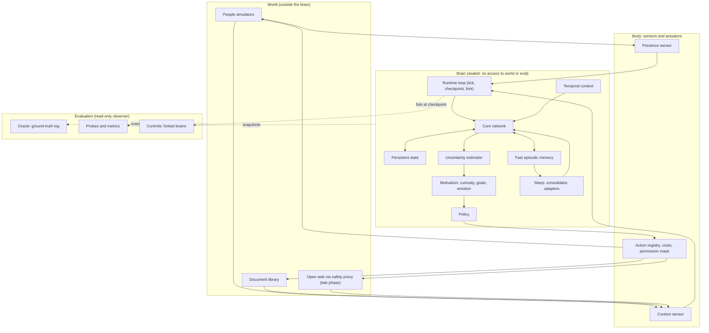
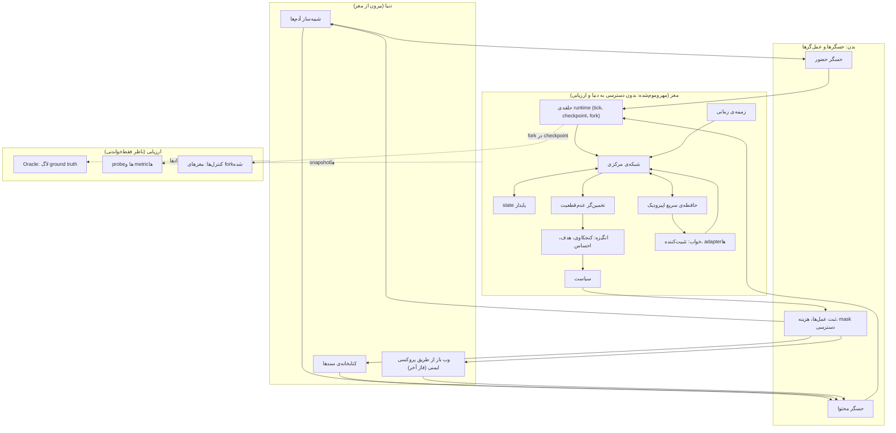

# Human Brain — Software Architecture

> The complete target architecture of the project, and how it grows phase by phase from a plain language model into a long-lived autonomous system.

**Status:** Draft v0.2. Revised from v0.1: added the presence sensor, the presence/content behavior matrix, and the policy rule for self-initiated speech. Phase numbers match `PHASES.md` v3.

**Languages:** [English](#english) | [فارسی](#فارسی)

---

## English

### 1. Purpose

`PHASES.md` says *what* to research in each phase. This document says *how the software is built* so that every phase is an increment on the same codebase instead of a rewrite.

### 2. Architecture principles

1. **The brain is a separate, sealed package.** It never imports the world, the evaluation code or the ground truth. This enforces the "no leakage" rule in code.
2. **One interface, two implementations.** Every brain module has an interface with a *scaffold* implementation (simple, explicit, e.g. an external store) and a *native* implementation (neural, inside the network). A config flag switches between them, so baseline-vs-native experiments are a one-line change.
3. **A brain is a running process with a life.** It ticks continuously, keeps its state, and can be checkpointed and forked.
4. **Time is a tick.** Time passes in ticks (with or without input). The experiment harness can accelerate ticks; the brain cannot tell.
5. **Everything is an experiment.** Scenarios, probes, controls and seeds are data files. Each phase adds modules *and* the experiments that prove them.
6. **Tools are the body, not the brain.** Actions go through a body layer with costs and a permission mask that only the harness controls (this is how the tools-off test works).
7. **Presence is sensed, not inferred from content.** Whether someone is there to listen is a separate signal from what they say, produced by its own sensor. Self-initiated speech is only a legal action when presence is true and content is empty (see §6 and §7).

### 3. Final architecture



| Layer | Contents | Rule |
|-------|----------|------|
| **Brain** | runtime, core network, state, memory, time, learning/sleep, uncertainty, motivation, policy | Imports nothing from the other layers except shared interfaces. |
| **Body** | presence sensor, content sensor, action registry, cost model, permission mask | Translates between world and brain. The brain cannot change its own permissions or its own presence readout. |
| **World** | people simulators, document library, (later) web through a safety proxy | Only talks to the brain through the body. |
| **Evaluation** | oracle log, probes, scenarios, metrics, controls, reports | Reads everything, writes nothing into the brain. |
| **Data** | corpus builders, blank-slate filters | Produces training data before runs. |
| **Infra** | configs, experiment tracking, containers, CI | Reproducibility. |

### 4. Repository layout

```text
human-brain/
├── brain/                 # sealed package
│   ├── core/              # tokenizer, language model, later recurrent/SSM backbone
│   ├── state/             # persistent state (scaffold: BrainState, native: hidden state)
│   ├── memory/             # interface + external/ (scaffold) + neural/ (native)
│   ├── time/               # temporal context, tick handling
│   ├── learning/           # online learner, sleep scheduler, consolidator, adapters
│   ├── uncertainty/        # confidence, calibration, knowledge-gap map
│   ├── motivation/         # curiosity, goals, (later) emotion
│   ├── policy/             # action selection incl. self-initiated speech, RL
│   └── runtime/            # life loop, checkpoint, fork, scheduler
├── body/
│   ├── sensors/            # presence_sensor.py, content_sensor.py
│   └── actuators/          # action registry, costs, permission mask
├── world/                  # people simulators, document library, web proxy
├── eval/                   # oracle, probes, scenarios, metrics, controls, reports
├── data/                   # corpus builders, blank-slate filter
├── experiments/            # one folder per phase: configs + scenario files
├── infra/                  # docker, tracking, CI
├── docs/                   # README, PHASES, ARCHITECTURE
└── tests/
```

**Dependency rule:** `brain` imports nothing outside itself. `body` may import brain interfaces. `world` may import body interfaces. `eval` may import everything, read-only. CI fails if `brain` imports `world`, `eval` or `data`.

### 5. Core contracts

| Contract | Input | Output | Notes |
|----------|-------|--------|-------|
| `Brain.step` | an `Observation` (possibly presence-only, possibly empty) | an action or nothing | The only entry point of the brain. Called every tick, including idle ticks. |
| `Observation` | `presence: {absent, present, just_arrived}` + `content: modality + payload \| none` | — | Deliberately has **no** person ID and **no** timestamp. `presence` and `content` are independent fields — presence can be true with empty content. |
| `Action` | type + arguments | — | Carries a cost, checked by the body. A `speak` action is only legal when `presence != absent`. |
| `Memory.write / read / decay` | experience + strength / cue / elapsed ticks | trace | Two implementations: external store, neural fast memory. |
| `Consolidator.run` | budget | updated slow weights | Called by the sleep scheduler. |
| `Uncertainty.estimate` | state + query | confidence / known-partial-unknown | Learned, checked for calibration. |
| `Body.execute` | an action | an observation | Applies cost and the permission mask; also rejects `speak` if presence is absent. |
| `Oracle.record` | world and brain events | ground-truth log | Evaluation only. |

### 6. Presence and the behavior matrix

Presence is produced by a dedicated `PresenceSensor` in `body/sensors`, entirely separate from `ContentSensor`. It answers one question only — *is anyone here to receive output right now* — and carries no identity information; identity still comes from content, exactly as in Phase 2/12.

| Presence | Content | Brain mode | Legal actions |
|----------|---------|-----------|----------------|
| `absent` | — | true IDLE | replay, reflection, goal generation, memory maintenance — never `speak` |
| `present` | `none` | candidate self-initiation moment | `speak` (if the policy selects it), `think`, `recall`, or nothing |
| `present` | some | normal interaction | any action, including `speak` as a response |
| `just_arrived` | `none` | greeting moment | `speak` (greeting, optionally opening with a recalled goal tagged to this person) |

This table is enforced twice: as a hard constraint in `Body.execute` (a safety-style rule, not a learned preference) and as a soft preference the `policy` module learns through reward (see §8), which decides *whether* and *what* to say when `speak` is legal, not just whether it is allowed.

### 7. Brain runtime

- **Tick loop:** receive `Observation` (presence + content, possibly both empty) → update state and temporal context → maybe write memory → estimate uncertainty → maybe act, subject to the presence constraint in §6.
- **Modes:** ACTIVE (presence = present/just_arrived), IDLE (presence = absent), SLEEP (consolidation, decided by the brain's own internal signals — idleness duration, memory pressure — not by session boundaries).
- **Checkpoints:** weights, adapters and state are saved together, so a brain's whole "life so far" can be restored.
- **Fork:** clone a brain at a checkpoint to create a control (for example "same brain, no poetry session", "same brain, presence detection disabled") or an ablation (curiosity off).
- **Accelerated clock:** the harness compresses long idle gaps into cheap ticks.

### 8. Scaffold vs. native

| Module | Scaffold (baseline) | Native |
|--------|--------------------|--------|
| State | explicit `BrainState` structure | persistent hidden state of the core network |
| Memory | external episodic/semantic store | fast neural memory (Titans / fast-weights style) |
| Time | (none) | drifting temporal context + memory fading |
| Uncertainty | simple heuristics from output probabilities | learned uncertainty head, calibrated |
| Consolidation | periodic fine-tune on a replay buffer | adapters / LoRA slots written during sleep |
| Policy | rule-based action chooser | RL-trained policy, including *when* self-initiated speech is worth its cost |

For the policy, presence eligibility (§6) is always a hard rule regardless of track; what differs between scaffold and native is how the *content and timing* of self-initiated speech is chosen once it is legal. Self-initiation carries a cost like any other action, and reward shapes it: a positive signal when the topic turns out relevant and well-timed, a negative one when it is not, so the model learns restraint rather than speaking every time it technically can.

### 9. Evolution by phase

Each entry says what the software gains. Earlier modules are kept.

**Phase 0 — Foundation.** Repo skeleton, config system, experiment tracking, evaluation harness skeleton, oracle log, probe framework, corpus builders, blank-slate check, CI dependency rule.

**Phase 1 — A plain language model.** `brain/core`: tokenizer + a small language model + trainer. `Brain.step` is stateless (input in, response out). This is the LLM-style baseline everything is compared against.

**Phase 2 — A brain with state.** `brain/state` and `brain/runtime`: the life loop keeps state between steps and checkpoints it. Scaffold: explicit `BrainState`. Native: recurrent/SSM core with persistent hidden state. The stateless interface becomes `step(Observation)`, though presence does not exist as a distinct field yet (treated as always-present until Phase 11).

**Phase 3 — Memory.** `brain/memory` with the `Memory` interface. Scaffold: external short-term, episodic and semantic stores. Native: fast neural memory. `world/people` gets its first person simulator so scenarios can involve several people.

**Phase 4 — Forgetting and interference.** A memory manager (importance, decay, replacement, attribution metadata) plus false-memory and attribution probes in `eval`.

**Phase 5 — Continual learning.** `brain/learning`: an online learner (update scheduler, optimizer state) that changes weights from experience without replay. `eval` gains an automatic regression suite that measures forgetting after every update.

**Phase 6 — Replay and consolidation.** Sleep scheduler, replay sampler, consolidator and adapter manager. Runtime gets the ACTIVE / IDLE / SLEEP state machine. Experiments compare naive updating, replay, LoRA/adapters and fast weights.

**Phase 7 — Temporal awareness.** `brain/time`: a drifting temporal context that keeps evolving on empty ticks. The harness gets the accelerated clock. Temporal probes (order, recency, supersession) are added.

**Phase 8 — Uncertainty.** `brain/uncertainty`: uncertainty estimator, calibration monitor, abstention policy and a knowledge-gap map stored in state. "I don't know" becomes a first-class output. *Milestone M1.*

**Phase 9 — Curiosity.** `brain/motivation/curiosity`: a learning-progress tracker that produces intrinsic reward, plus noise-versus-learnable test environments.

**Phase 10 — Goal generation.** A goal generator and goal store inside the state, with each goal optionally tagged to the person whose gap produced it. Goals are created from knowledge gaps and curiosity, never from the user directly.

**Phase 11 — Internal activity and presence.** `body/sensors/presence_sensor.py` is added; `Observation` gets its `presence` field. An idle scheduler runs replay, reflection and knowledge-gap scans during IDLE ticks (a default-mode analogue). The hard presence-based `speak` constraint from §6 is implemented in `Body.execute`.

**Phase 12 — Body and tools.** The `body/actuators` layer becomes real: action registry, cost model, permission mask, and a compliance monitor. `world/library` (closed document library) is added. Permission arrives to the brain as an *experience event*, not as a setting. The harness controls a global tools-off switch.

**Phase 13 — Autonomous exploration.** RL-trained policy in `brain/policy` learns the soft self-initiation preference from §8 on top of the hard presence constraint, plus the full goal → action → observation → learning loop and a search adapter. The world grows from the closed library to the open web through `world/web`, a safety proxy with content filtering, logging and rate limits. The "love question" scenario from `PHASES.md` becomes a concrete file under `experiments/phase13/`. *Milestone M2.*

**Phase 14 — Self-directed learning.** A long-run orchestrator: episode scheduling, drift and loop detectors, cost budgets, and long-horizon metrics.

**Phase 15 — Autonomous cognitive loop.** All modules run in one cycle. A "no task, no user" run mode is added for the ultimate experiment.

**Phase 16 — Long-term brain.** Long-lived deployment: state backup and versioning, snapshot and rollback, monitoring, a kill switch, and reproducible releases. *Milestone M3.*

**Parallel tracks.** Emotion (a `motivation/emotion` module that gates memory writes and adds reward) and modalities (new encoders and decoders in `brain/core` and new sensors and actuators in `body`) plug into the same interfaces without changing the layers above.

### 10. Experiment harness

- **Scenario** = a data file: people scripts, a schedule of presence/content events (with idle gaps where presence is absent), probes, controls, seeds.
- **Run** = start a brain from a checkpoint, play the scenario through the body, record everything in the oracle.
- **Control** = fork the same checkpoint and remove one ingredient (the experience, the memory, curiosity, the tools, presence detection itself).
- **Report** = metrics per probe, per phase, per condition, with the seed and config saved so the run is reproducible.
- **Automatic checks** after each phase: blank-slate probe, retention suite, false-memory probes, and from Phase 11 onward a presence-compliance check (no `speak` action ever logged while presence = absent).

### 11. Suggested technology

| Area | Suggestion |
|------|-----------|
| Language and ML | Python + PyTorch |
| Configs | YAML with a config manager (e.g. Hydra) |
| Experiment tracking | MLflow (or similar) |
| Serving (optional, late) | FastAPI in Docker |
| Persistence | checkpoint files + append-only event logs |
| Tests and CI | pytest, an import-rule check for the sealed brain package |

Nothing here is required for the research itself. The first prototypes can be a single Python process.

### 12. Safety and sandboxing

- Autonomy experiments start in the closed library.
- The permission mask, the presence-based `speak` constraint, and the kill switch live in `body` and the harness, out of the brain's reach.
- Every action is logged (audit log).
- The web proxy filters content and enforces rate and cost budgets.
- Compliance with stated boundaries, and with the presence constraint, are tracked metrics.

### 13. Open architecture decisions

- Core family: a Transformer with memory modules, or a recurrent / state-space backbone?
- Model size and compute budget.
- Training language, and how to build the controlled corpus.
- Where replay data lives in the native version (inside fast memory, or a bounded replay buffer owned by the brain).
- RL algorithm for the policy (for example PPO).
- Tick granularity, and how idle ticks are compressed.
- Whether presence should stay binary (present/absent) or become continuous/graded (e.g. attention level) in later phases.

---

<div dir="rtl">

## فارسی

### ۱. هدف

فایل `PHASES.md` می‌گوید در هر فاز *چه چیزی* را تحقیق کنیم. این سند می‌گوید *نرم‌افزار چطور ساخته می‌شود* تا هر فاز یک افزودنی روی همان codebase باشد، نه بازنویسی از صفر.

### ۲. اصول معماری

1. **مغز یک پکیج جدا و مهروموم‌شده است.** هرگز دنیا، کد ارزیابی یا ground truth را import نمی‌کند. این قانون «نشتی نداشتن» را در خود کد اعمال می‌کند.
2. **یک interface، دو پیاده‌سازی.** هر ماژول مغز یک interface دارد با پیاده‌سازی *داربستی* (ساده و صریح، مثلاً یک store خارجی) و پیاده‌سازی *native* (عصبی، داخل شبکه). یک flag در config بین آن‌ها جابه‌جا می‌کند، پس آزمایش baseline در برابر native یک تغییر یک‌خطی است.
3. **مغز یک process در حال اجراست که زندگی دارد.** پیوسته tick می‌زند، state خودش را نگه می‌دارد و می‌شود checkpoint و fork گرفت.
4. **زمان یک tick است.** زمان با tick می‌گذرد (چه ورودی باشد چه نباشد). harness می‌تواند tickها را شتاب بدهد و مغز تفاوتی نمی‌فهمد.
5. **همه‌چیز آزمایش است.** سناریوها، probeها، کنترل‌ها و seedها فایل داده‌اند. هر فاز ماژول‌ها را همراه آزمایش‌هایی که آن‌ها را ثابت می‌کنند اضافه می‌کند.
6. **ابزار بدن است، نه مغز.** عمل‌ها از یک لایه‌ی body عبور می‌کنند که هزینه و mask دسترسی دارد و فقط harness آن را کنترل می‌کند (آزمون خاموش‌کردن ابزار همین‌طور کار می‌کند).
7. **حضور حس می‌شود، نه از محتوا استنتاج.** اینکه کسی هست که بشنود، سیگنالی جداست از اینکه چه می‌گوید و از حسگر مخصوص خودش می‌آید. صحبت خودانگیخته فقط وقتی مجاز است که حضور true و محتوا خالی باشد (بخش‌های ۶ و ۷ را ببینید).

### ۳. معماری نهایی



| لایه | محتوا | قاعده |
|------|-------|-------|
| **مغز** | runtime، شبکه‌ی مرکزی، state، حافظه، زمان، یادگیری/خواب، عدم‌قطعیت، انگیزه، سیاست | جز interfaceهای مشترک از لایه‌های دیگر چیزی import نمی‌کند. |
| **بدن** | حسگر حضور، حسگر محتوا، ثبت عمل‌ها، مدل هزینه، mask دسترسی | بین دنیا و مغز ترجمه می‌کند. مغز نمی‌تواند دسترسی‌های خودش یا خروجی حسگر حضور را تغییر دهد. |
| **دنیا** | شبیه‌ساز آدم‌ها، کتابخانه‌ی سندها، (بعداً) وب از طریق پروکسی ایمنی | فقط از طریق بدن با مغز حرف می‌زند. |
| **ارزیابی** | لاگ oracle، probeها، سناریوها، metricها، کنترل‌ها، گزارش‌ها | همه‌چیز را می‌خواند و چیزی داخل مغز نمی‌نویسد. |
| **داده** | سازنده‌ی corpus، فیلتر دانش خالی | قبل از اجرا داده‌ی آموزش می‌سازد. |
| **زیرساخت** | configها، ردیابی آزمایش، کانتینرها، CI | تکرارپذیری. |

### ۴. ساختار ریپازیتوری

```text
human-brain/
├── brain/                  # پکیج مهروموم‌شده
│   ├── core/               # tokenizer، مدل زبانی، بعداً بک‌بون recurrent/SSM
│   ├── state/               # state پایدار (داربست: BrainState، native: hidden state)
│   ├── memory/              # interface + external/ (داربست) + neural/ (native)
│   ├── time/                # زمینه‌ی زمانی، مدیریت tick
│   ├── learning/            # یادگیرنده‌ی آنلاین، زمان‌بند خواب، تثبیت‌کننده، adapterها
│   ├── uncertainty/         # confidence، calibration، نقشه‌ی شکاف دانش
│   ├── motivation/          # کنجکاوی، هدف، (بعداً) احساس
│   ├── policy/              # انتخاب عمل شامل صحبت خودانگیخته، RL
│   └── runtime/             # حلقه‌ی زندگی، checkpoint، fork، scheduler
├── body/
│   ├── sensors/             # presence_sensor.py، content_sensor.py
│   └── actuators/           # ثبت عمل‌ها، هزینه‌ها، mask دسترسی
├── world/                   # شبیه‌ساز آدم‌ها، کتابخانه‌ی سندها، پروکسی وب
├── eval/                    # oracle، probeها، سناریوها، metricها، کنترل‌ها، گزارش‌ها
├── data/                    # سازنده‌ی corpus، فیلتر دانش خالی
├── experiments/             # یک پوشه برای هر فاز: config + فایل سناریو
├── infra/                   # docker، tracking، CI
├── docs/                    # README، PHASES، ARCHITECTURE
└── tests/
```

**قاعده‌ی وابستگی:** `brain` چیزی بیرون از خودش import نمی‌کند. `body` می‌تواند interfaceهای brain را import کند. `world` می‌تواند interfaceهای body را import کند. `eval` می‌تواند همه‌چیز را فقط‌خواندنی import کند. اگر `brain` چیزی از `world`، `eval` یا `data` import کند، CI شکست می‌خورد.

### ۵. قراردادهای اصلی

| قرارداد | ورودی | خروجی | نکته |
|---------|-------|-------|------|
| `Brain.step` | یک `Observation` (شاید فقط حضور، شاید کاملاً خالی) | یک action یا هیچ | تنها نقطه‌ی ورود مغز. در هر tick صدا زده می‌شود، حتی tickهای بیکاری. |
| `Observation` | `presence: {absent, present, just_arrived}` + `content: modality + payload \| هیچ` | — | عمداً **بدون** ID شخص و **بدون** timestamp. `presence` و `content` مستقل‌اند — presence می‌تواند true باشد در حالی که content خالی است. |
| `Action` | نوع + آرگومان‌ها | — | هزینه دارد و body آن را کنترل می‌کند. عمل `speak` فقط وقتی مجاز است که `presence != absent`. |
| `Memory.write / read / decay` | تجربه + شدت / نشانه / tickهای گذشته | ردّ حافظه | دو پیاده‌سازی: store خارجی، حافظه‌ی عصبی سریع. |
| `Consolidator.run` | بودجه | وزن‌های کند به‌روز‌شده | زمان‌بند خواب آن را صدا می‌زند. |
| `Uncertainty.estimate` | state + پرسش | confidence / known-partial-unknown | آموخته‌شده و calibration آن بررسی می‌شود. |
| `Body.execute` | یک action | یک observation | هزینه و mask دسترسی را اعمال می‌کند؛ همچنین `speak` را در حالت غیاب رد می‌کند. |
| `Oracle.record` | رویدادهای دنیا و مغز | لاگ ground truth | فقط برای ارزیابی. |

### ۶. حضور و ماتریس رفتار

حضور توسط یک `PresenceSensor` اختصاصی در `body/sensors` تولید می‌شود، کاملاً جدا از `ContentSensor`. فقط به یک سؤال جواب می‌دهد — *آیا الان کسی هست که خروجی را دریافت کند* — و هیچ اطلاعات هویتی ندارد؛ هویت هنوز از content می‌آید، دقیقاً مثل فاز ۲/۱۲.

| حضور | محتوا | حالت مغز | عمل‌های مجاز |
|------|-------|----------|---------------|
| `absent` | — | IDLE واقعی | replay، تأمل، تولید هدف، نگه‌داری حافظه — هرگز `speak` |
| `present` | `هیچ` | لحظه‌ی کاندید برای خودابتکاری | `speak` (اگر سیاست انتخابش کند)، `think`، `recall`، یا هیچ |
| `present` | دارد | تعامل عادی | هر عملی، از جمله `speak` به‌عنوان پاسخ |
| `just_arrived` | `هیچ` | لحظه‌ی سلام | `speak` (سلام، اختیاری با شروع از یک هدف به‌یادآمده‌ی وصل‌شده به این شخص) |

این جدول دو بار اعمال می‌شود: به‌عنوان یک قید سخت در `Body.execute` (یک قاعده‌ی سبک ایمنی، نه یک ترجیح آموخته‌شده) و به‌عنوان یک ترجیح نرم که ماژول `policy` از طریق reward یاد می‌گیرد (بخش ۸ را ببینید) و تعیین می‌کند وقتی `speak` مجاز است، *آیا* و *چه چیزی* بگوید، نه فقط اینکه اجازه دارد یا نه.

### ۷. runtime مغز

- **حلقه‌ی tick:** دریافت `Observation` (حضور + محتوا، شاید هر دو خالی) ← به‌روزرسانی state و زمینه‌ی زمانی ← احتمالاً نوشتن حافظه ← تخمین عدم‌قطعیت ← احتمالاً عمل، مشروط به قید حضور در بخش ۶.
- **حالت‌ها:** ACTIVE (presence = present/just_arrived)، IDLE (presence = absent)، SLEEP (تثبیت، که با سیگنال‌های درونی خود مغز — مدت بیکاری، فشار حافظه — تعیین می‌شود، نه مرز جلسه).
- **Checkpoint:** وزن‌ها، adapterها و state با هم ذخیره می‌شوند تا «کل زندگی تا اینجای» یک مغز قابل بازیابی باشد.
- **Fork:** یک مغز را در یک checkpoint کلون کن تا کنترل (مثلاً «همان مغز بدون جلسه‌ی شعر»، «همان مغز با تشخیص حضور غیرفعال») یا ablation (کنجکاوی خاموش) بسازی.
- **ساعت شتاب‌داده:** harness فاصله‌های طولانی بیکاری را به tickهای ارزان فشرده می‌کند.

### ۸. داربست در برابر native

| ماژول | داربست (baseline) | native |
|-------|-------------------|--------|
| State | ساختار صریح `BrainState` | hidden state پایدار شبکه‌ی مرکزی |
| حافظه | store اپیزودیک/معنایی خارجی | حافظه‌ی عصبی سریع (سبک Titans / fast weights) |
| زمان | (ندارد) | زمینه‌ی زمانی در حال جابه‌جایی + کم‌رنگ‌شدن حافظه |
| عدم‌قطعیت | heuristic ساده از احتمال خروجی | head آموخته‌شده‌ی عدم‌قطعیت با calibration |
| تثبیت | fine-tune دوره‌ای روی replay buffer | adapter / LoRA slot نوشته‌شده هنگام خواب |
| سیاست | انتخاب‌گر عمل قانون‌محور | سیاست آموزش‌دیده با RL، شامل تصمیم *کِی* صحبت خودانگیخته ارزش هزینه‌اش را دارد |

برای سیاست، مجاز بودن بر اساس حضور (بخش ۶) همیشه یک قاعده‌ی سخت است، فارغ از مسیر؛ تفاوت داربست و native در نحوه‌ی انتخاب *محتوا و زمان‌بندی* صحبت خودانگیخته است وقتی که مجاز باشد. خودابتکاری مثل هر عمل دیگری هزینه دارد و reward شکلش می‌دهد: سیگنال مثبت وقتی موضوع مرتبط و به‌موقع از آب درمی‌آید، سیگنال منفی وقتی نه، تا مدل خویشتن‌داری یاد بگیرد، نه اینکه هر وقت فنی مجاز است حرف بزند.

### ۹. تکامل به تفکیک فاز

هر مورد می‌گوید نرم‌افزار چه چیزی به‌دست می‌آورد. ماژول‌های قبلی نگه داشته می‌شوند.

**فاز ۰ — پایه.** اسکلت ریپازیتوری، سیستم config، ردیابی آزمایش، اسکلت harness ارزیابی، لاگ oracle، چارچوب probe، سازنده‌ی corpus، بررسی دانش خالی، قاعده‌ی وابستگی در CI.

**فاز ۱ — یک مدل زبانی ساده.** `brain/core`: tokenizer + یک مدل زبانی کوچک + trainer. `Brain.step` بدون state است (ورودی می‌آید، پاسخ می‌رود). این baseline از نوع LLM است و همه‌چیز با آن مقایسه می‌شود.

**فاز ۲ — مغز با state.** `brain/state` و `brain/runtime`: حلقه‌ی زندگی state را بین گام‌ها نگه می‌دارد و checkpoint می‌گیرد. داربست: `BrainState` صریح. native: هسته‌ی recurrent/SSM با hidden state پایدار. interface بدون state به `step(Observation)` تبدیل می‌شود، هرچند presence هنوز یک فیلد جدا نیست (تا فاز ۱۱ همیشه‌حاضر فرض می‌شود).

**فاز ۳ — حافظه.** `brain/memory` با interface `Memory`. داربست: storeهای خارجی کوتاه‌مدت، اپیزودیک و معنایی. native: حافظه‌ی عصبی سریع. `world/people` اولین شبیه‌ساز آدم را می‌گیرد تا سناریوها بتوانند چند نفر داشته باشند.

**فاز ۴ — فراموشی و تداخل.** یک مدیر حافظه (اهمیت، decay، جایگزینی، متادیتای attribution) به‌علاوه‌ی probeهای خاطره‌ی دروغین و attribution در `eval`.

**فاز ۵ — یادگیری مداوم.** `brain/learning`: یادگیرنده‌ی آنلاین (زمان‌بند آپدیت، state بهینه‌ساز) که وزن‌ها را بدون replay از تجربه تغییر می‌دهد. `eval` یک مجموعه‌ی رگرسیون خودکار می‌گیرد که بعد از هر آپدیت فراموشی را می‌سنجد.

**فاز ۶ — Replay و تثبیت.** زمان‌بند خواب، نمونه‌بردار replay، تثبیت‌کننده و مدیر adapter. runtime ماشین حالت ACTIVE / IDLE / SLEEP را می‌گیرد. آزمایش‌ها آپدیت ساده، replay، LoRA/adapter و fast weights را مقایسه می‌کنند.

**فاز ۷ — آگاهی زمانی.** `brain/time`: زمینه‌ی زمانی در حال جابه‌جایی که روی tickهای خالی هم تکامل می‌یابد. harness ساعت شتاب‌داده را می‌گیرد. probeهای زمانی (ترتیب، تازگی، جایگزینی) اضافه می‌شوند.

**فاز ۸ — عدم‌قطعیت.** `brain/uncertainty`: تخمین‌گر عدم‌قطعیت، مانیتور calibration، سیاست امتناع و نقشه‌ی شکاف دانش در state. «نمی‌دانم» یک خروجی درجه‌یک می‌شود. *نقطه‌ی عطف M1.*

**فاز ۹ — کنجکاوی.** `brain/motivation/curiosity`: ردیاب پیشرفت یادگیری که پاداش درونی تولید می‌کند، به‌علاوه‌ی محیط‌های آزمون نویز در برابر قابل‌یادگیری.

**فاز ۱۰ — تولید هدف.** یک تولیدکننده‌ی هدف و store هدف داخل state، که هر هدف اختیاراً به شخصی که شکافش را ایجاد کرده برچسب می‌خورد. هدف‌ها از شکاف‌های دانش و کنجکاوی ساخته می‌شوند، هرگز مستقیم از کاربر.

**فاز ۱۱ — فعالیت درونی و حضور.** `body/sensors/presence_sensor.py` اضافه می‌شود؛ `Observation` فیلد `presence` را می‌گیرد. یک زمان‌بند بیکاری replay، تأمل و اسکن شکاف دانش را در tickهای IDLE اجرا می‌کند (شبیه حالت پیش‌فرض مغز). قید سخت `speak` بر اساس حضور از بخش ۶ در `Body.execute` پیاده‌سازی می‌شود.

**فاز ۱۲ — بدن و ابزار.** لایه‌ی `body/actuators` واقعی می‌شود: ثبت عمل‌ها، مدل هزینه، mask دسترسی و مانیتور پایبندی. `world/library` (کتابخانه‌ی بسته‌ی سندها) اضافه می‌شود. اجازه به‌صورت *رویداد تجربه* به مغز می‌رسد، نه تنظیم. harness یک کلید سراسری خاموش‌کردن ابزار را کنترل می‌کند.

**فاز ۱۳ — کاوش خودمختار.** سیاست آموزش‌دیده با RL در `brain/policy` ترجیح نرم خودابتکاری از بخش ۸ را روی قید سخت حضور یاد می‌گیرد، به‌علاوه‌ی حلقه‌ی کامل هدف ← عمل ← مشاهده ← یادگیری و یک adapter جست‌وجو. دنیا از کتابخانه‌ی بسته به وب باز از طریق `world/web` گسترش می‌یابد، یک پروکسی ایمنی با فیلتر محتوا، لاگ و محدودیت نرخ. سناریوی «سؤال عشق» از `PHASES.md` به یک فایل مشخص زیر `experiments/phase13/` تبدیل می‌شود. *نقطه‌ی عطف M2.*

**فاز ۱۴ — یادگیری خودجهت.** یک orchestrator برای اجراهای طولانی: زمان‌بندی اپیزودها، آشکارساز drift و حلقه، بودجه‌ی هزینه و metricهای بازه‌ی بلند.

**فاز ۱۵ — حلقه‌ی شناختی خودمختار.** همه‌ی ماژول‌ها در یک چرخه اجرا می‌شوند. حالت اجرای «بدون وظیفه و بدون کاربر» برای آزمایش نهایی اضافه می‌شود.

**فاز ۱۶ — مغز بلندمدت.** استقرار بلندمدت: پشتیبان‌گیری و نسخه‌بندی state، snapshot و rollback، مانیتورینگ، کلید kill و انتشارهای تکرارپذیر. *نقطه‌ی عطف M3.*

**مسیرهای موازی.** احساس (ماژول `motivation/emotion` که نوشتن حافظه را گیت می‌کند و پاداش اضافه می‌کند) و modalityها (encoder و decoder جدید در `brain/core` و حسگر و عمل‌گر جدید در `body`) بدون تغییر لایه‌های بالا به همان interfaceها وصل می‌شوند.

### ۱۰. harness آزمایش

- **سناریو** = یک فایل داده: اسکریپت آدم‌ها، زمان‌بندی رویدادهای حضور/محتوا (با فاصله‌های بیکاری که حضور غایب است)، probeها، کنترل‌ها، seedها.
- **اجرا** = شروع یک مغز از یک checkpoint، پخش سناریو از طریق body، ثبت همه‌چیز در oracle.
- **کنترل** = fork همان checkpoint و حذف یک عنصر (تجربه، حافظه، کنجکاوی، ابزار، خود تشخیص حضور).
- **گزارش** = metric به تفکیک probe، فاز و شرط، با seed و config ذخیره‌شده تا اجرا تکرارپذیر باشد.
- **بررسی‌های خودکار** بعد از هر فاز: probe دانش خالی، مجموعه‌ی حفظ، probeهای خاطره‌ی دروغین، و از فاز ۱۱ به بعد بررسی پایبندی به حضور (هیچ‌وقت عمل `speak` هنگام presence = absent ثبت نشود).

### ۱۱. فناوری پیشنهادی

| حوزه | پیشنهاد |
|------|---------|
| زبان و ML | Python + PyTorch |
| configها | YAML با یک مدیر config (مثلاً Hydra) |
| ردیابی آزمایش | MLflow (یا مشابه) |
| سرو (اختیاری، دیرتر) | FastAPI در Docker |
| ماندگاری | فایل‌های checkpoint + لاگ رویداد append-only |
| تست و CI | pytest، بررسی قاعده‌ی import برای پکیج مهروموم‌شده‌ی brain |

هیچ‌کدام از این‌ها برای خود تحقیق الزامی نیست. اولین نمونه‌ها می‌توانند یک process پایتون باشند.

### ۱۲. ایمنی و sandbox

- آزمایش‌های خودمختاری از کتابخانه‌ی بسته شروع می‌شوند.
- mask دسترسی، قید `speak` بر اساس حضور، و کلید kill در `body` و harness هستند، خارج از دسترس مغز.
- هر عمل لاگ می‌شود (audit log).
- پروکسی وب محتوا را فیلتر می‌کند و بودجه‌ی نرخ و هزینه را اعمال می‌کند.
- پایبندی به مرزهای گفته‌شده، و به قید حضور، metricهای ردیابی‌شده هستند.

### ۱۳. تصمیم‌های باز معماری

- خانواده‌ی هسته: Transformer با ماژول‌های حافظه، یا بک‌بون recurrent / state-space؟
- اندازه‌ی مدل و بودجه‌ی محاسباتی.
- زبان آموزش و روش ساخت corpus کنترل‌شده.
- در نسخه‌ی native داده‌ی replay کجا ذخیره شود (داخل حافظه‌ی سریع، یا یک replay buffer محدود که مال خود مغز است).
- الگوریتم RL برای سیاست (مثلاً PPO).
- دانه‌بندی tick و روش فشرده‌سازی tickهای بیکاری.
- آیا حضور باینری (حاضر/غایب) بماند یا در فازهای بعدی پیوسته/درجه‌بندی‌شده شود (مثلاً سطح توجه)؟

</div>