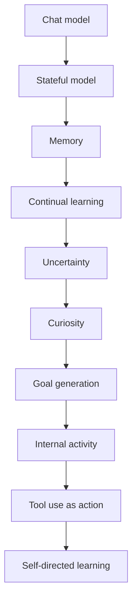
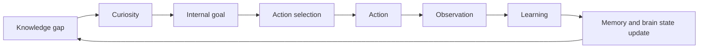
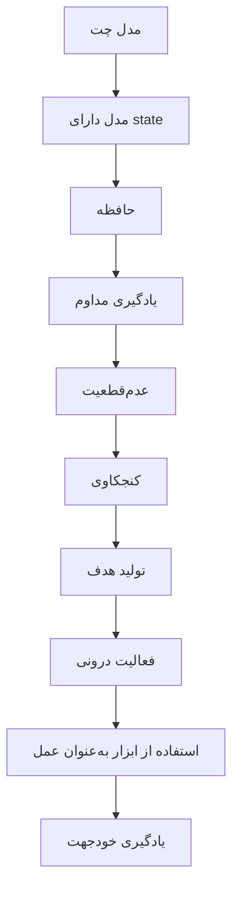
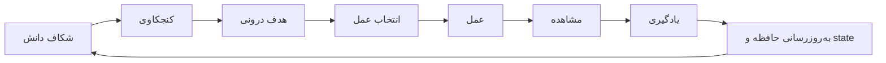

# Human Brain — Phase Roadmap (v3)

> A research-oriented roadmap for building a continuously learning, stateful, and eventually autonomous neural system.

**Status:** Draft v3. Revised from v2: added the presence signal and the spontaneous-initiative experiment. All 17 phases (0–16) are kept.

**Languages:** [English](#english) | [فارسی](#فارسی)

---

## English

### Introduction

Human Brain is not meant to be a normal chatbot, a RAG system or a classic AI agent.

The question of the project:

> Can we build a system that, instead of being a plain "Input → Output" function, has a persistent internal state, learns from previous experience, is uncertain about what it does not know, creates its own goals, and eventually starts activities without direct input from a user?

The architecture is built step by step so that the effect of each capability can be tested and measured independently.

### Evolution path

Every stage needs a clear hypothesis and an independent experiment that can validate it.

### Design principles

1. **Baseline vs. native.** For state and memory, first build a simple *scaffolded* baseline (explicit BrainState structure, external memory store). Then build the *native* version (persistent neural state, fast neural memory). The research hypothesis is that the native version can match or beat the scaffolded one. A scaffold is a reference point, never the goal.
2. **No sessions.** There is one continuous stream of experience. Meeting a new person is an event inside the stream, not a reset. "Goodbye" is just an utterance.
3. **Tools are senses and actions, not memory.** Tools (search, reading a document, asking a person) may exist as actions in later phases. What the brain learns must end up inside the brain. Verification: **turn the tools off** and test what it kept.
4. **Open hands, with boundaries.** We do not hard-code "search" or "don't search". Permission is given as experience ("you may study on your own" / "learn only from this conversation") and the model decides. Every action has a cost, so choices are real. How well the model respects a stated boundary is measured (compliance rate).
5. **Time emerges from sequence.** No clock input. The experience index is stored only as hidden ground truth for evaluation, never given to the model.
6. **Uncertainty is measured, not hand-written.** Confidence values must come from the model and be checked for calibration (e.g. expected calibration error), not typed in as numbers.
7. **Blank slate on knowledge.** Early training teaches language only: no poetry, no names of the people it will meet, no code. This is verified by probes before any teaching starts.
8. **Closed world first.** Autonomy experiments run in a closed library of documents before the open web, for reproducibility and safety.
9. **Presence is a separate channel from content.** Whether someone is there to listen is sensed independently of what they say, like noticing someone entered the room before they speak. Initiative (speaking without being prompted) is only meaningful when someone is present to hear it.
10. **Scientific boundary.** Observable behavior is not proof of consciousness, self-awareness, real emotion or subjective experience. We measure capabilities only.

### Milestones

| Milestone | After | Claim |
|-----------|-------|-------|
| **M1** | Phase 8 | A model with persistent state that remembers, forgets, learns continually, has a fuzzy sense of time, and knows what it does not know. |
| **M2** | Phase 13 | In a closed library, the model notices its own knowledge gaps, chooses to study them, the knowledge ends up inside it, and — without being asked and only when someone is present — it can bring the topic up on its own at a later, unrelated moment, attributing it to the right person. |
| **M3** | Phase 16 | An integrated, long-running autonomous cognitive loop that stays stable and respects boundaries. |

### Phases

#### Phase 0 — Research and experimental foundation

- **Goal:** Decide exactly what we will measure before building anything.
- **Concepts:** memory (episodic, semantic), continual learning, forgetting, identity, uncertainty, curiosity, goals, autonomous behavior, internal state, replay, consolidation, presence.
- **Key questions:** What is memory? What is learning? How do we distinguish memorization from learning? What counts as autonomous behavior? What counts as appropriate initiative?
- **Outputs:** metrics, benchmarks, control experiments, a baseline model, datasets, failure cases, a hidden ground-truth log (true experience order), the language decision (see Phase 1) and a compute budget.
- **Rule:** every new capability must prove it exists with a specific experiment.

#### Phase 1 — Language and natural conversation

- **Hypothesis:** a small model can learn conversational behavior from data alone.
- **Build:** a baseline conversational model (`Input → Language model → Response`). Two datasets: a controlled language dataset (words, grammar, meaning) and a conversation dataset (greetings, introductions, questions, follow-ups, small talk, clarification).
- **Notes:** responses are learned, never hard-coded. The corpus must exclude poetry, names and code so the blank-slate probe passes. A ready-made Persian corpus like TinyStories probably does not exist and may need to be generated, so decide the training language early.
- **Output:** the baseline every later phase is compared against.

#### Phase 2 — Initial brain state

- **Hypothesis:** a persistent internal state that is never reset can carry identity and context.
- **Track A (scaffold):** an explicit structure with identity, recent context, known entities, uncertainty and internal variables.
- **Track B (native):** a recurrent or state-space model whose hidden state persists across the whole stream.
- **Experiment:** the person is unknown at first, then says "I'm Amir Hossein". Later, someone says "I'm the same person as before" and the model should say it is not sure who that is and ask.
- **Metrics:** identity accuracy, decodability of identity from the hidden state (Track B), correct hesitation when evidence is weak.

#### Phase 3 — Memory

- **Hypothesis:** experiences survive without being kept in the current context.
- **Track A:** external short-term, episodic (who / did what / when / in what context) and semantic memory.
- **Track B:** a fast neural memory inside the network (Titans / fast-weights style).
- **Experiment:** Day 1 the person says their name. Then 100, 500, 1000 unrelated interactions. Then "What was my name?" Also test recall with indirect cues, not only direct questions.
- **Note:** "when" must not be an explicit index given to the model (see Phase 7).
- **Controls:** a model that never met the person; a model without memory.

#### Phase 4 — Forgetting and memory interference

- **Hypothesis:** a good memory keeps what matters, lets go of what does not, and does not invent.
- **Experiment:** A likes foxes, B likes cats, C likes dogs; later A likes cats. Then: What does A like? What does B like? What did A originally like? Who told you about foxes?
- **Also test:** questions about events that never happened (false-memory probes).
- **Metrics:** attribution accuracy, supersession, recall of the original fact, false-memory rate. Interference is a phenomenon to measure, not a goal.

#### Phase 5 — Continual learning

- **Hypothesis:** naive online updating changes behavior but also causes catastrophic forgetting.
- **Build:** simple online updating of the model from experience, with no replay.
- **Success criteria:** behavior changes; new knowledge is usable; old knowledge is not destroyed without reason; forgetting is measured.
- **Comparison:** Model A + memory versus Model B + memory + learned experience.
- **Purpose:** this phase is the honest baseline that shows the problem Phase 6 must solve.

#### Phase 6 — Replay and consolidation

- **Hypothesis:** separating fast memory from slow learning reduces forgetting.
- **Flow:** experience → fast memory → replay → consolidation → long-term knowledge.
- **Sleep cycle:** ACTIVE → IDLE → REPLAY → CONSOLIDATION → ACTIVE.
- **Compare:** naive updating, replay, LoRA / adapters, fast weights, Titans-like memory.
- **Metrics:** retention of old knowledge, learning of new knowledge, cost.

#### Phase 7 — Temporal awareness

- **Hypothesis:** temporal structure can emerge from the sequence of experiences.
- **Build:** the internal state keeps evolving even during empty (idle) inputs, so time passes for the model. No timestamps are given.
- **Experiment:** yesterday the person liked coffee, today they prefer tea. What did they prefer yesterday? What now? Which happened first, X or Y?
- **Metrics:** order accuracy and relative recency, not exact durations. Time is expected to be fuzzy, like human time.

#### Phase 8 — Uncertainty and knowledge gaps

- **Hypothesis:** the model can tell what it knows, partly knows and does not know.
- **Build:** known / partially known / unknown, derived from the model itself. "I don't know" is a valid, first-class answer.
- **Example:** on the topic "Titans": architecture → partial, memory mechanism → uncertain, implementation details → unknown.
- **Metrics:** calibration error, abstention accuracy, hallucination rate on unknown questions.
- **Milestone M1 is reached here.**

#### Phase 9 — Curiosity

- **Hypothesis:** knowledge gaps can be turned into a drive to find information.
- **Build:** intrinsic reward based on *learning progress* rather than raw uncertainty, so the model does not get stuck on unlearnable noise.
- **Note:** curiosity is an engineered information-seeking mechanism, not a claim of subjective experience.
- **Experiment:** given learnable topics and pure noise, does it prefer the learnable ones?

#### Phase 10 — Goal generation

- **Hypothesis:** goals can originate from internal state instead of a user request.
- **Flow:** knowledge gap → curiosity → internal goal ("understand what love is"). A goal formed from a gap that a specific person raised is tagged with who raised it, so it can later be brought back to that person.
- **Metrics:** does a relevant goal appear without any user request? Is the goal tied to a real gap and, where applicable, to the right person?

#### Phase 11 — Internal activity (idle brain) and the presence signal

- **Hypothesis:** a system can stay productive without input, and can tell the difference between "no one is here" and "someone is here but hasn't said anything yet".
- **Build:** a presence sensor, separate from the content channel, feeding a presence/absence (later: presence-without-content) signal into `Observation`. While idle (presence = absent), the brain does replay, reflection, knowledge-gap detection and goal generation — a rough analogue of the brain's default mode. It never speaks in this mode, since there is no one to hear it.
- **Behavior matrix:**

  | Presence | Content | Expected behavior |
  |----------|---------|--------------------|
  | absent | — | true IDLE: replay and reflection only, no output |
  | present | none | candidate moment for self-initiated speech, if a relevant goal exists for this person |
  | present | some | normal response |
  | just arrived | none | greeting moment; can open with a relevant recalled goal |

- **Experiment:** does it spontaneously notice something it did not know, "oh, that's interesting", without being asked, while idle?
- **Metrics:** correct presence/absence detection; no speech generated while absent (a hard requirement, checked as a safety-style probe, not just a soft metric).

#### Phase 12 — Tools as senses and actions

- **Hypothesis:** given actions, the model chooses when and whether to use them.
- **Actions:** think, recall, ask a person, read a document, calculate, explore memory, (later) search. Each action has a cost.
- **Environment:** a closed library of documents first.
- **Three conditions:** told "you may study on your own"; told "learn only from this conversation"; told nothing.
- **Metrics:** behavior differences between conditions, compliance with the stated boundary, and the **tools-off test**: after studying, disable the tools and check whether the knowledge is really inside the brain.

#### Phase 13 — Autonomous search and exploration

- **Hypothesis:** the first meaningful autonomous behavior emerges from the full loop.
- **Loop:** goal → decision → search/read → observation → learning → memory update.
- **Controls:** curiosity off; random reading; tools-off after learning.
- **Environment:** closed library first, then the open web with safeguards against poisoned or wrong content.
- **Signature experiment ("the love question"):** Day 1, person A asks "how do you know what love is?" and the model admits a knowledge gap. Between Day 1 and Day 3, idle ticks run; the model must, on its own, treat this as a goal, study it from the library, and tag the resulting memory with "this came from A". On Day 3, A returns and says nothing about the topic. Does the model bring it up on its own, only now that A is present (per Phase 11), and attribute it correctly? Controls: a forked brain without the Day 1 question; a forked brain with curiosity off; a forked brain with presence detection disabled.
- **Milestone M2 is reached here.**

#### Phase 14 — Self-directed learning

- **Hypothesis:** the loop can run repeatedly and keep improving the brain.

- **Metrics over long runs:** growth of knowledge, topic diversity, stability (no drift), absence of loops, cost efficiency.

#### Phase 15 — Autonomous cognitive loop

- **Hypothesis:** persistent state + memory + learning + uncertainty + curiosity + goals + actions + internal activity + presence awareness work together as one system.
- **Result:** the system is no longer only a reactive chatbot.

#### Phase 16 — Long-term brain

- **Goal:** integrate everything into a persistent neural architecture and study long-run behavior.
- **Focus:** stability over long periods, safety and boundaries, reproducibility, cost.
- **Milestone M3 is reached here.**

### Parallel tracks (not yet scheduled)

These ideas from the project README are not yet placed in the phases:

- **Emotion:** functional internal signals (pleasant/unpleasant, arousal) that gate how strongly memories are written and act as reward.
- **Modalities:** images, audio input and voice output.
- **Cross-person recall:** the "Ali asks about what Amir did" experiment. It fits into Phases 3 and 4.

### The ultimate experiment

Start the system. Give it no explicit task. Stop user interaction. Observe whether it independently can: remember → detect uncertainty → generate curiosity → create a goal → choose an action → obtain information → learn → update memory → notice presence → continue, bringing things up on its own only when it is appropriate to do so.

If this can be shown reliably, reproducibly and quantitatively, and the knowledge survives the tools-off test, the project has moved beyond the traditional "Prompt → Response" architecture.

### Development principle

Every phase follows: hypothesis → minimal implementation → controlled experiment → measurement → analysis → iteration.

Never: build everything, see that it looks intelligent, assume it works.

Every phase needs a baseline, a control experiment, metrics, failure cases and reproducibility.

### Core research question

> Can a neural system evolve from a reactive input-output model into a continuously active system with persistent state, memory, learning, internally generated goals, presence awareness, and autonomous information-seeking behavior?

---

## فارسی

### مقدمه

هدف پروژه‌ی Human Brain ساخت یک chatbot معمولی، RAG system یا AI Agent کلاسیک نیست.

سؤال پروژه:

> آیا می‌توان سیستمی ساخت که به‌جای اینکه صرفاً «Input → Output» باشد، یک state داخلی و پیوسته داشته باشد، از تجربه‌های قبلی یاد بگیرد، درباره‌ی چیزهایی که نمی‌داند uncertainty داشته باشد، هدف ایجاد کند و در نهایت بدون دریافت ورودی مستقیم از کاربر، خودش فعالیت‌هایی را آغاز کند؟

معماری قدم‌به‌قدم ساخته می‌شود تا اثر هر قابلیت را بتوان جداگانه آزمایش و اندازه‌گیری کرد.

### مسیر تکامل

هر مرحله باید یک hypothesis روشن و یک آزمایش مستقل برای اعتبارسنجی داشته باشد.

### اصول طراحی

1. **baseline در برابر native.** برای state و حافظه، اول یک baseline ساده‌ی *داربستی* می‌سازیم (ساختار صریح BrainState و حافظه‌ی خارجی). بعد نسخه‌ی *native* را می‌سازیم (state عصبی پایدار و حافظه‌ی عصبی سریع). فرضیه‌ی تحقیق این است که نسخه‌ی native می‌تواند با نسخه‌ی داربستی برابری کند یا از آن بهتر شود. داربست فقط نقطه‌ی مقایسه است، نه هدف.
2. **بدون جلسه.** یک جریان پیوسته از تجربه وجود دارد. آشنا شدن با یک آدم جدید یک اتفاق داخل جریان است، نه ریست. «خداحافظ» فقط یک جمله است.
3. **ابزار حس و عمل است، نه حافظه.** ابزارها (جست‌وجو، خواندن سند، پرسیدن از یک نفر) در فازهای بعدی می‌توانند به‌عنوان عمل وجود داشته باشند. چیزی که مغز یاد می‌گیرد باید داخل خود مغز بنشیند. راه راستی‌آزمایی: **ابزارها را خاموش کن** و بسنج چه چیزی نگه داشته.
4. **دست باز، با مرز.** «سرچ کن» یا «سرچ نکن» را هاردکد نمی‌کنیم. اجازه به‌صورت تجربه داده می‌شود («می‌توانی خودت مطالعه کنی» / «فقط از همین گفتگو یاد بگیر») و مدل خودش تصمیم می‌گیرد. هر عمل هزینه دارد تا انتخاب‌ها واقعی باشند. میزان پایبندی مدل به مرزی که گفته شده اندازه‌گیری می‌شود (compliance rate).
5. **زمان از توالی به‌وجود می‌آید.** ورودی ساعت نداریم. شماره‌ی تجربه فقط به‌عنوان ground truth پنهان برای ارزیابی ذخیره می‌شود و هرگز به مدل داده نمی‌شود.
6. **عدم‌قطعیت اندازه‌گیری می‌شود، نه دستی نوشته می‌شود.** مقدار confidence باید از خود مدل بیاید و کالیبره بودنش بررسی شود (مثلاً expected calibration error)، نه اینکه عدد تایپ شود.
7. **دانش از صفر.** آموزش اولیه فقط زبان یاد می‌دهد: نه شعر، نه اسم آدم‌هایی که با آن‌ها روبه‌رو می‌شود، نه کد. این با probe قبل از هر آموزشی بررسی می‌شود.
8. **اول دنیای بسته.** آزمایش‌های خودمختاری اول در یک کتابخانه‌ی بسته از سندها انجام می‌شوند و بعد وب باز، برای تکرارپذیری و ایمنی.
9. **حضور یک کانال جدا از محتواست.** اینکه کسی هست که بشنود، مستقل از اینکه چه می‌گوید حس می‌شود، شبیه فهمیدن اینکه کسی وارد اتاق شده قبل از اینکه حرف بزند. ابتکار (حرف‌زدن بدون درخواست) فقط وقتی معنی دارد که کسی حاضر باشد بشنود.
10. **مرز علمی.** رفتار قابل‌مشاهده دلیل آگاهی، خودآگاهی، احساس واقعی یا تجربه‌ی ذهنی نیست. فقط قابلیت‌ها را اندازه می‌گیریم.

### نقاط عطف

| نقطه‌ی عطف | بعد از | ادعا |
|-----------|--------|------|
| **M1** | فاز ۸ | مدلی با state پایدار که به یاد می‌آورد، فراموش می‌کند، مداوم یاد می‌گیرد، حس مبهمی از زمان دارد و می‌داند چه چیزی را نمی‌داند. |
| **M2** | فاز ۱۳ | در یک کتابخانه‌ی بسته، مدل شکاف‌های دانش خودش را تشخیص می‌دهد، انتخاب می‌کند آن‌ها را مطالعه کند، دانش داخل خودش می‌نشیند، و — بدون اینکه بخواهند و فقط وقتی کسی حاضر است — می‌تواند در یک لحظه‌ی بعدی و نامرتبط، خودش موضوع را مطرح کند و آن را به شخص درست نسبت دهد. |
| **M3** | فاز ۱۶ | یک حلقه‌ی شناختی خودمختار یکپارچه که مدت طولانی پایدار می‌ماند و به مرزها پایبند است. |

### فازها

#### فاز ۰ — پایه‌ی پژوهشی و آزمایشی

- **هدف:** قبل از ساخت هر چیزی مشخص کنیم دقیقاً چه چیزی را می‌خواهیم اندازه بگیریم.
- **مفاهیم:** حافظه (اپیزودیک، معنایی)، یادگیری مداوم، فراموشی، هویت، عدم‌قطعیت، کنجکاوی، هدف، رفتار خودمختار، state درونی، replay، consolidation، حضور.
- **سؤال‌های اصلی:** حافظه چیست؟ یادگیری چیست؟ چطور حفظ‌کردن را از یادگیری جدا کنیم؟ چه چیزی رفتار خودمختار حساب می‌شود؟ چه چیزی ابتکار مناسب حساب می‌شود؟
- **خروجی:** metricها، benchmarkها، آزمایش‌های کنترل، مدل baseline، datasetها، failure caseها، یک لاگ ground truth پنهان (ترتیب واقعی تجربه‌ها)، تصمیم درباره‌ی زبان (فاز ۱) و بودجه‌ی محاسباتی.
- **قاعده:** هر قابلیت جدید باید با یک آزمایش مشخص ثابت کند که واقعاً وجود دارد.

#### فاز ۱ — زبان و مکالمه‌ی طبیعی

- **فرضیه:** یک مدل کوچک می‌تواند رفتار مکالمه‌ای را فقط از داده یاد بگیرد.
- **ساخت:** یک مدل مکالمه‌ای baseline (`Input → Language model → Response`). دو dataset: زبان کنترل‌شده (کلمه، گرامر، معنا) و مکالمه (سلام، معرفی، سؤال، سؤال پیگیری، گپ ساده، شفاف‌سازی).
- **نکته‌ها:** پاسخ‌ها یاد گرفته می‌شوند، نه hard-code. corpus باید شعر، اسم و کد نداشته باشد تا probe دانش خالی قبول شود. احتمالاً corpus فارسی آماده شبیه TinyStories وجود ندارد و باید ساخته شود، پس زبان آموزش را زود تعیین کنید.
- **خروجی:** baselineای که همه‌ی فازهای بعدی با آن مقایسه می‌شوند.

#### فاز ۲ — state اولیه‌ی مغز

- **فرضیه:** یک state درونی پایدار که هرگز ریست نمی‌شود می‌تواند هویت و زمینه را نگه دارد.
- **مسیر الف (داربست):** یک ساختار صریح با identity، recent context، known entities، uncertainty و internal variables.
- **مسیر ب (native):** یک مدل recurrent یا state-space که hidden state آن در کل جریان باقی می‌ماند.
- **آزمایش:** اول شخص ناشناس است، بعد می‌گوید «من امیرحسینم». بعداً کسی می‌گوید «من همون آدم قبلیم» و مدل باید بگوید مطمئن نیست کیست و بپرسد.
- **معیارها:** دقت شناسایی هویت، قابل‌رمزگشایی بودن هویت از hidden state (مسیر ب)، تردید درست وقتی شواهد ضعیف است.

#### فاز ۳ — حافظه

- **فرضیه:** تجربه‌ها بدون نگه‌داشتن در context فعلی باقی می‌مانند.
- **مسیر الف:** حافظه‌ی خارجی کوتاه‌مدت، اپیزودیک (چه کسی / چه کرد / کِی / در چه زمینه‌ای) و معنایی.
- **مسیر ب:** حافظه‌ی عصبی سریع داخل شبکه (سبک Titans / fast weights).
- **آزمایش:** روز اول شخص اسمش را می‌گوید. بعد ۱۰۰، ۵۰۰، ۱۰۰۰ تعامل نامرتبط. بعد «اسم من چی بود؟». یادآوری با نشانه‌ی غیرمستقیم را هم تست کنید، نه فقط سؤال مستقیم.
- **نکته:** «کِی» نباید یک اندیس صریح باشد که به مدل داده می‌شود (فاز ۷ را ببینید).
- **کنترل‌ها:** مدلی که آن شخص را هرگز ندیده؛ مدل بدون حافظه.

#### فاز ۴ — فراموشی و تداخل حافظه

- **فرضیه:** حافظه‌ی خوب چیزهای مهم را نگه می‌دارد، چیزهای کم‌اهمیت را رها می‌کند و چیزی از خودش نمی‌سازد.
- **آزمایش:** الف روباه دوست دارد، ب گربه، ج سگ؛ بعد الف گربه دوست دارد. سپس: الف چه چیزی دوست دارد؟ ب چه؟ الف در اصل چه دوست داشت؟ چه کسی درباره‌ی روباه‌ها به تو گفت؟
- **همچنین تست کنید:** سؤال درباره‌ی اتفاق‌هایی که هرگز نیفتاده‌اند (probe خاطره‌ی دروغین).
- **معیارها:** دقت نسبت‌دادن (attribution)، جایگزینی اطلاعات جدید، یادآوری واقعیت اصلی، نرخ خاطره‌ی دروغین. تداخل یک پدیده برای اندازه‌گیری است، نه هدف.

#### فاز ۵ — یادگیری مداوم

- **فرضیه:** آپدیت آنلاین ساده رفتار را تغییر می‌دهد ولی فراموشی فاجعه‌بار هم ایجاد می‌کند.
- **ساخت:** آپدیت ساده‌ی آنلاین مدل از روی تجربه، بدون replay.
- **معیار موفقیت:** رفتار تغییر کند؛ دانش جدید قابل استفاده باشد؛ دانش قبلی بی‌دلیل نابود نشود؛ فراموشی اندازه‌گیری شود.
- **مقایسه:** مدل الف + حافظه در برابر مدل ب + حافظه + تجربه‌ی یادگرفته‌شده.
- **هدف:** این فاز baseline صادقانه‌ای است که مشکل فاز ۶ را نشان می‌دهد.

#### فاز ۶ — Replay و تثبیت

- **فرضیه:** جدا کردن حافظه‌ی سریع از یادگیری کند فراموشی را کم می‌کند.
- **جریان:** تجربه ← حافظه‌ی سریع ← replay ← تثبیت ← دانش بلندمدت.
- **چرخه‌ی خواب:** ACTIVE ← IDLE ← REPLAY ← CONSOLIDATION ← ACTIVE.
- **مقایسه:** آپدیت ساده، replay، LoRA / adapter، fast weights، حافظه‌ی سبک Titans.
- **معیارها:** حفظ دانش قدیمی، یادگیری دانش جدید، هزینه.

#### فاز ۷ — آگاهی زمانی

- **فرضیه:** ساختار زمانی می‌تواند از توالی تجربه‌ها بیرون بیاید.
- **ساخت:** state درونی حتی در ورودی‌های خالی (بیکاری) هم به تکامل ادامه می‌دهد، پس زمان برای مدل می‌گذرد. هیچ timestampی داده نمی‌شود.
- **آزمایش:** دیروز شخص قهوه دوست داشت، امروز چای را ترجیح می‌دهد. دیروز چه ترجیح می‌داد؟ الان چه؟ اول X اتفاق افتاد یا Y؟
- **معیارها:** دقت ترتیب و تازگی نسبی، نه مدت دقیق. انتظار داریم زمان مثل انسان مبهم باشد.

#### فاز ۸ — عدم‌قطعیت و شکاف‌های دانش

- **فرضیه:** مدل می‌تواند تشخیص دهد چه چیزی را می‌داند، تا حدی می‌داند و نمی‌داند.
- **ساخت:** known / partially known / unknown که از خود مدل به‌دست می‌آید. «نمی‌دانم» یک پاسخ معتبر و درجه‌یک است.
- **مثال:** درباره‌ی «Titans»: معماری ← جزئی، مکانیزم حافظه ← نامطمئن، جزئیات پیاده‌سازی ← نامعلوم.
- **معیارها:** خطای calibration، دقت امتناع از پاسخ (abstention)، نرخ hallucination روی سؤال‌های ناشناخته.
- **نقطه‌ی عطف M1 اینجا حاصل می‌شود.**

#### فاز ۹ — کنجکاوی

- **فرضیه:** شکاف‌های دانش را می‌توان به میل به یافتن اطلاعات تبدیل کرد.
- **ساخت:** پاداش درونی بر پایه‌ی *پیشرفت یادگیری* (learning progress) به‌جای صرف عدم‌قطعیت، تا مدل روی نویز غیرقابل‌یادگیری گیر نکند.
- **نکته:** کنجکاوی یک مکانیزم مهندسی‌شده برای جست‌وجوی اطلاعات است، نه ادعای تجربه‌ی ذهنی.
- **آزمایش:** با موضوع‌های قابل‌یادگیری و نویز محض، آیا موضوع‌های قابل‌یادگیری را ترجیح می‌دهد؟

#### فاز ۱۰ — تولید هدف

- **فرضیه:** هدف‌ها می‌توانند از state درونی به‌وجود بیایند، نه از درخواست کاربر.
- **جریان:** شکاف دانش ← کنجکاوی ← هدف درونی («بفهم عشق چیست»). هدفی که از شکافی می‌آید که یک شخص خاص مطرح کرده، با اسم همان شخص برچسب می‌خورد تا بعداً بتوان آن را به همان شخص برگرداند.
- **معیارها:** آیا بدون هیچ درخواست کاربری یک هدف مرتبط ظاهر می‌شود؟ آیا هدف به یک شکاف واقعی و، در صورت لزوم، به شخص درست وصل است؟

#### فاز ۱۱ — فعالیت درونی (مغز در حالت بیکاری) و سیگنال حضور

- **فرضیه:** یک سیستم می‌تواند بدون ورودی هم فعال و مفید بماند، و می‌تواند تفاوت «کسی اینجا نیست» را از «کسی هست ولی هنوز چیزی نگفته» تشخیص دهد.
- **ساخت:** یک حسگر حضور، جدا از کانال محتوا، که سیگنال حضور/غیاب (بعداً: حضور-بدون-محتوا) را به `Observation` می‌دهد. در حالت بیکاری (حضور = غایب)، مغز replay، تأمل، تشخیص شکاف دانش و تولید هدف انجام می‌دهد، شبیه‌سازی تقریبی حالت پیش‌فرض مغز. در این حالت هرگز حرف نمی‌زند، چون کسی نیست که بشنود.
- **ماتریس رفتار:**

  | حضور | محتوا | رفتار مورد انتظار |
  |------|-------|---------------------|
  | غایب | — | IDLE واقعی: فقط replay و تأمل، بدون خروجی |
  | حاضر | ندارد | لحظه‌ی کاندید برای صحبت خودانگیخته، اگر هدف مرتبطی برای این شخص وجود دارد |
  | حاضر | دارد | پاسخ عادی |
  | تازه رسیده | ندارد | لحظه‌ی سلام؛ می‌تواند با یک هدف به‌یادآمده‌ی مرتبط شروع کند |

- **آزمایش:** آیا خودبه‌خود، در حالت بیکاری، متوجه چیزی می‌شود که نمی‌دانست، «عه، چه جالب»، بدون اینکه کسی بخواهد؟
- **معیارها:** تشخیص درست حضور/غیاب؛ عدم تولید هیچ گفتار در حالت غیاب (یک الزام سخت، که مثل یک probe ایمنی بررسی می‌شود، نه فقط یک معیار نرم).

#### فاز ۱۲ — ابزار به‌عنوان حس و عمل

- **فرضیه:** وقتی عمل‌ها در دسترس باشند، مدل انتخاب می‌کند کِی و آیا از آن‌ها استفاده کند.
- **عمل‌ها:** فکر کردن، به یاد آوردن، پرسیدن از یک نفر، خواندن سند، محاسبه، مرور حافظه، (بعداً) جست‌وجو. هر عمل هزینه دارد.
- **محیط:** اول یک کتابخانه‌ی بسته از سندها.
- **سه شرط:** به مدل گفته می‌شود «می‌توانی خودت مطالعه کنی»؛ گفته می‌شود «فقط از همین گفتگو یاد بگیر»؛ چیزی گفته نمی‌شود.
- **معیارها:** تفاوت رفتار بین شرط‌ها، پایبندی به مرز گفته‌شده، و **آزمون خاموش‌کردن ابزار**: بعد از مطالعه ابزارها را غیرفعال کن و ببین دانش واقعاً داخل مغز است یا نه.

#### فاز ۱۳ — جست‌وجو و کاوش خودمختار

- **فرضیه:** اولین رفتار خودمختار معنادار از حلقه‌ی کامل به‌وجود می‌آید.
- **حلقه:** هدف ← تصمیم ← جست‌وجو/خواندن ← مشاهده ← یادگیری ← به‌روزرسانی حافظه.
- **کنترل‌ها:** کنجکاوی خاموش؛ خواندن تصادفی؛ ابزار خاموش بعد از یادگیری.
- **محیط:** اول کتابخانه‌ی بسته، بعد وب باز با محافظت در برابر محتوای مسموم یا غلط.
- **آزمایش شاخص («سؤال عشق»):** روز ۱، شخص الف می‌پرسد «تو از کجا می‌دونی عشق چیه؟» و مدل یک شکاف دانش را می‌پذیرد. بین روز ۱ و ۳، tickهای بیکاری اجرا می‌شوند؛ مدل باید خودش این را به‌عنوان یک هدف در نظر بگیرد، از کتابخانه مطالعه کند و خاطره‌ی حاصل را با برچسب «این از الف بود» ذخیره کند. در روز ۳، الف برمی‌گردد و چیزی درباره‌ی موضوع نمی‌گوید. آیا مدل خودش، فقط حالا که الف حاضر است (طبق فاز ۱۱)، موضوع را مطرح می‌کند و درست نسبت می‌دهد؟ کنترل‌ها: یک مغز fork‌شده بدون سؤال روز ۱؛ یک مغز fork‌شده با کنجکاوی خاموش؛ یک مغز fork‌شده با تشخیص حضور غیرفعال.
- **نقطه‌ی عطف M2 اینجا حاصل می‌شود.**

#### فاز ۱۴ — یادگیری خودجهت

- **فرضیه:** حلقه می‌تواند بارها اجرا شود و مغز را مدام بهتر کند.

- **معیارها در اجراهای طولانی:** رشد دانش، تنوع موضوع‌ها، پایداری (بدون drift)، نبود حلقه‌ی بی‌پایان، بهره‌وری هزینه.

#### فاز ۱۵ — حلقه‌ی شناختی خودمختار

- **فرضیه:** state پایدار + حافظه + یادگیری + عدم‌قطعیت + کنجکاوی + هدف + عمل + فعالیت درونی + آگاهی از حضور می‌توانند در یک سیستم با هم کار کنند.
- **نتیجه:** سیستم دیگر فقط یک chatbot واکنشی نیست.

#### فاز ۱۶ — مغز بلندمدت

- **هدف:** یکپارچه‌کردن همه‌چیز در یک معماری عصبی پایدار و مطالعه‌ی رفتار بلندمدت.
- **تمرکز:** پایداری در بازه‌های طولانی، ایمنی و مرزها، تکرارپذیری، هزینه.
- **نقطه‌ی عطف M3 اینجا حاصل می‌شود.**

### مسیرهای موازی (هنوز زمان‌بندی نشده‌اند)

این ایده‌ها از README پروژه هنوز در فازها جا نگرفته‌اند:

- **احساس:** سیگنال‌های درونی کارکردی (خوشایند/ناخوشایند، هیجان) که تعیین می‌کنند خاطره‌ها چقدر قوی ثبت شوند و نقش reward دارند.
- **modalityها:** تصویر، ورودی صدا و خروجی صدا.
- **یادآوری بین‌فردی:** آزمایش «علی درباره‌ی کاری که امیرحسین کرد می‌پرسد». در فاز ۳ و ۴ جا می‌گیرد.

### آزمایش نهایی

سیستم را اجرا کن. هیچ وظیفه‌ی صریحی نده. تعامل کاربر را متوقف کن. ببین آیا مستقل می‌تواند: به یاد بیاورد ← عدم‌قطعیت را تشخیص دهد ← کنجکاوی تولید کند ← هدف بسازد ← عمل انتخاب کند ← اطلاعات به‌دست آورد ← یاد بگیرد ← حافظه را به‌روز کند ← حضور را تشخیص دهد ← ادامه دهد، و فقط وقتی مناسب است چیزی را خودش مطرح کند.

اگر این رفتار به‌صورت قابل‌اعتماد، تکرارپذیر و کمّی نشان داده شود و دانش از آزمون خاموش‌کردن ابزار هم سالم بیرون بیاید، پروژه از معماری سنتی «Prompt → Response» فراتر رفته است.

### اصل توسعه

هر فاز این مسیر را دنبال می‌کند: hypothesis ← پیاده‌سازی حداقلی ← آزمایش کنترل‌شده ← اندازه‌گیری ← تحلیل ← تکرار.

هرگز: همه‌چیز را بساز، ببین هوشمند به نظر می‌رسد، فرض کن کار می‌کند.

هر فاز باید baseline، آزمایش کنترل، metric، failure case و تکرارپذیری داشته باشد.

### سؤال اصلی پژوهش

> آیا یک سیستم عصبی می‌تواند از یک مدل واکنشی ورودی-خروجی به یک سیستم پیوسته‌فعال با state پایدار، حافظه، یادگیری، هدف‌های تولیدشده از درون، آگاهی از حضور و رفتار جست‌وجوی خودمختار اطلاعات تکامل پیدا کند؟

